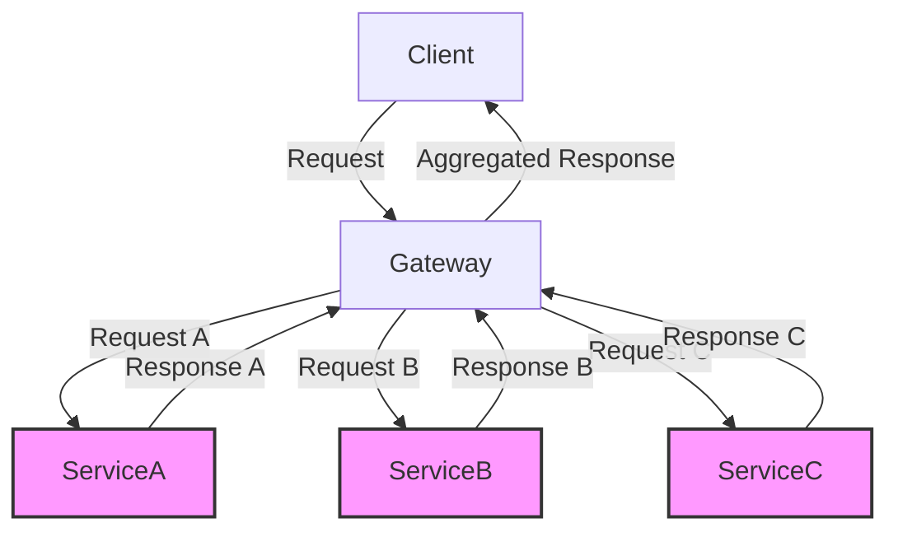
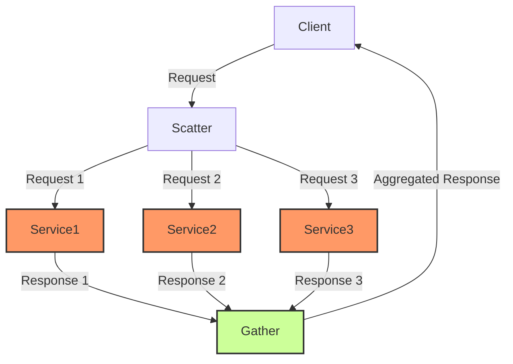
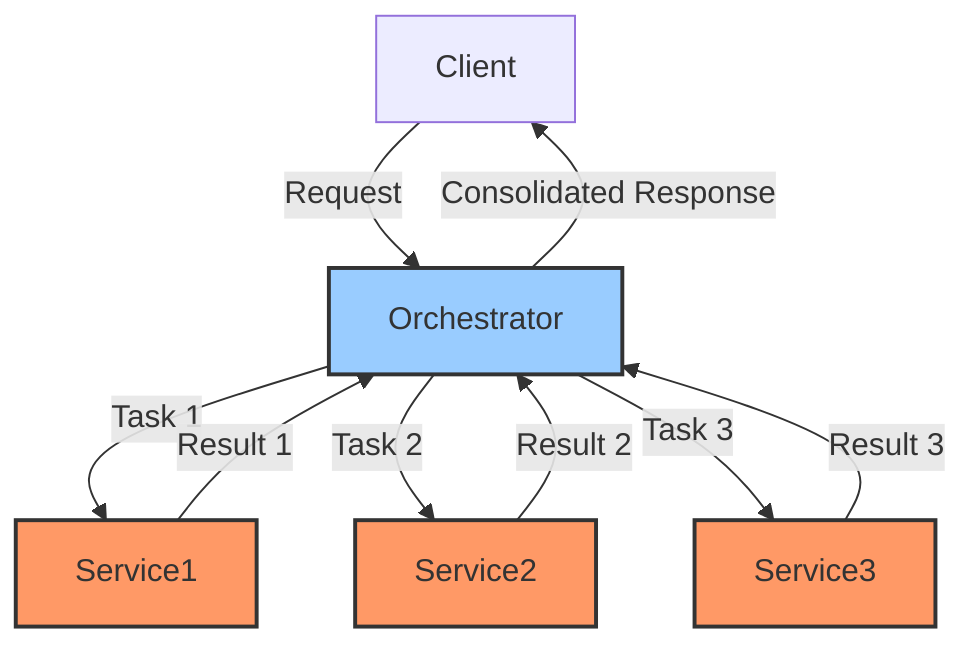
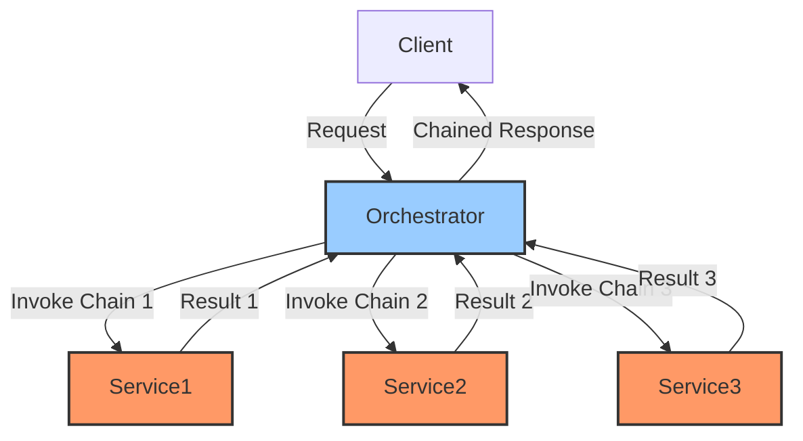
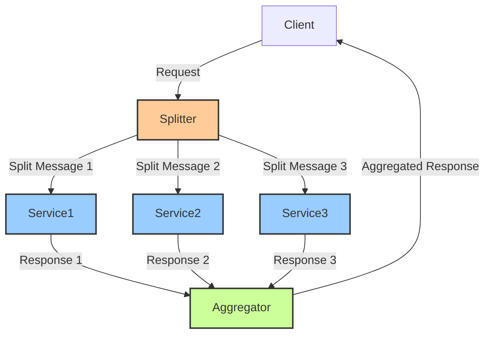
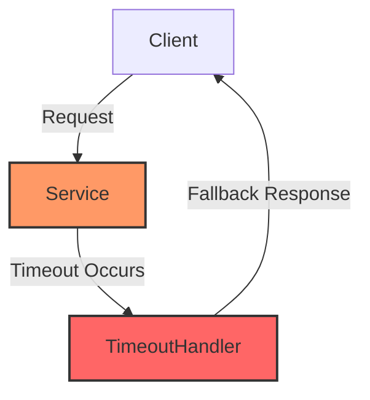
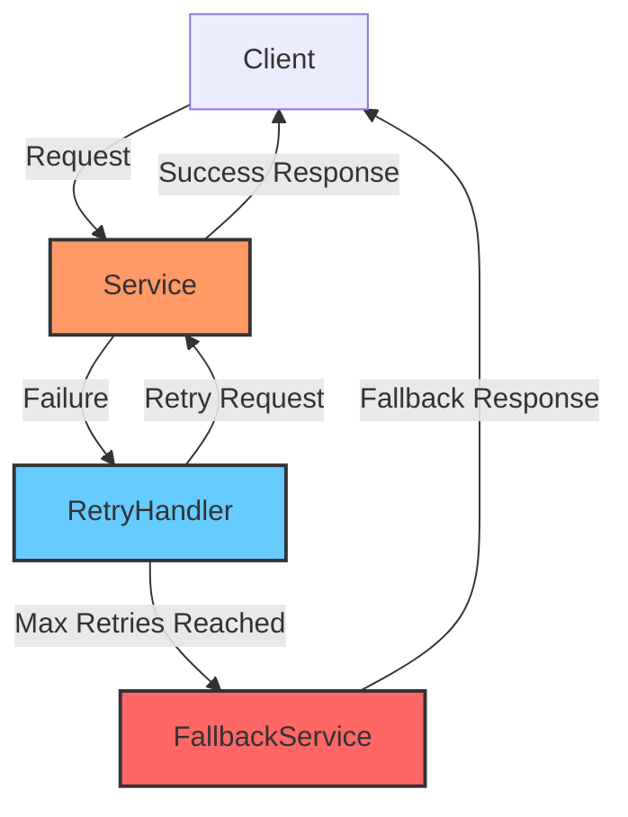
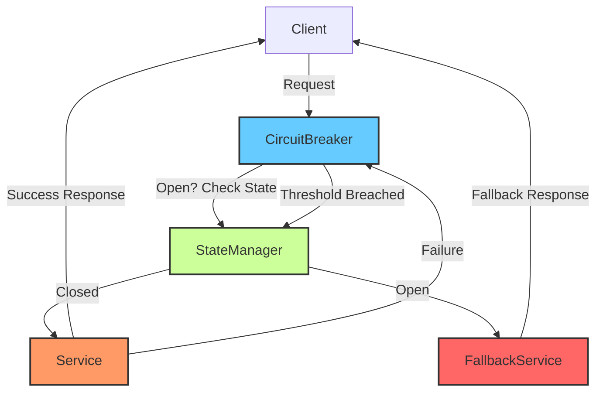
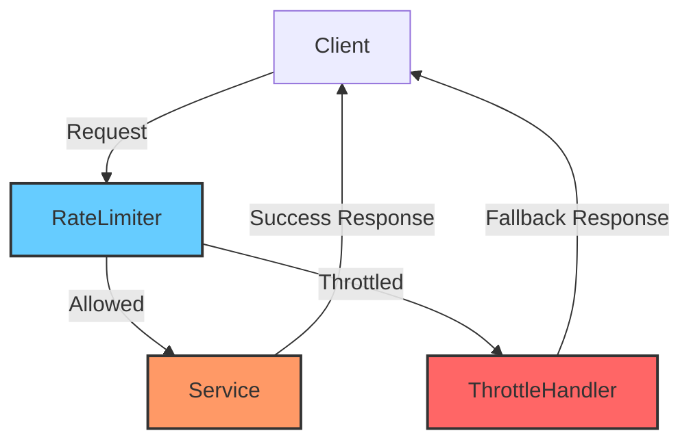
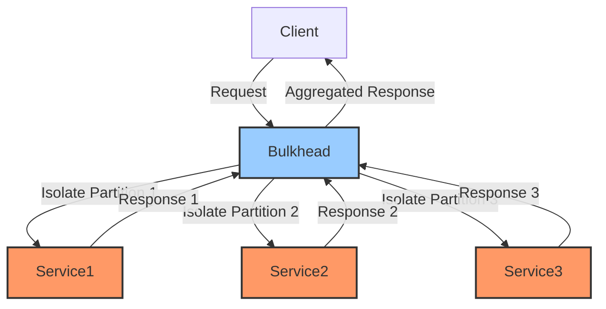

# Reactive Design Patterns

*Diagrams created with AI Assistant / AI Assistants*

### Gateway Aggregator Pattern

### Scatter Gather Pattern

### Orchestrator Pattern (For Parallel workflow)

### Orchestrator Pattern (For Sequential workflow)

### Splitter Pattern

---
## Resiliency Patterns

### Timeout Pattern

### Retry Pattern

### Circuit Breaker Pattern

### Rate Limiter Pattern

### Bulkhead Pattern

