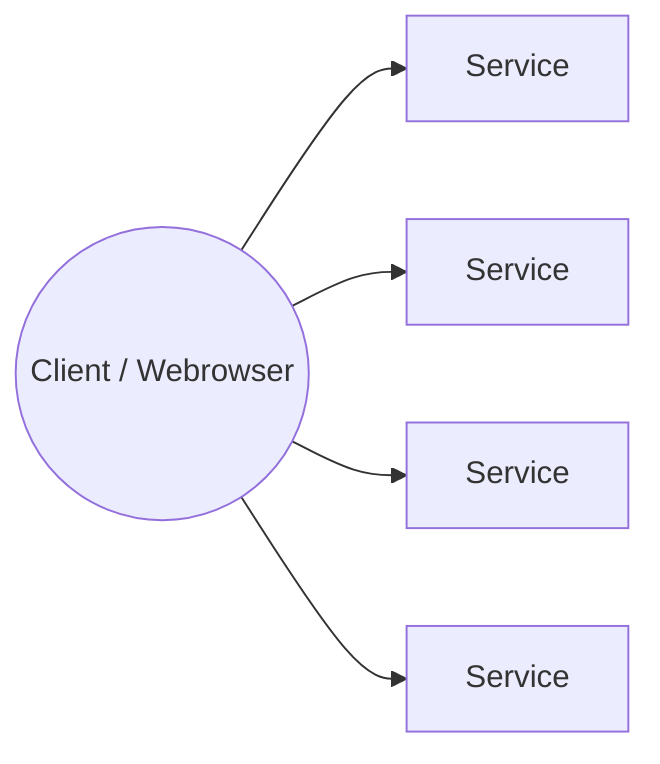
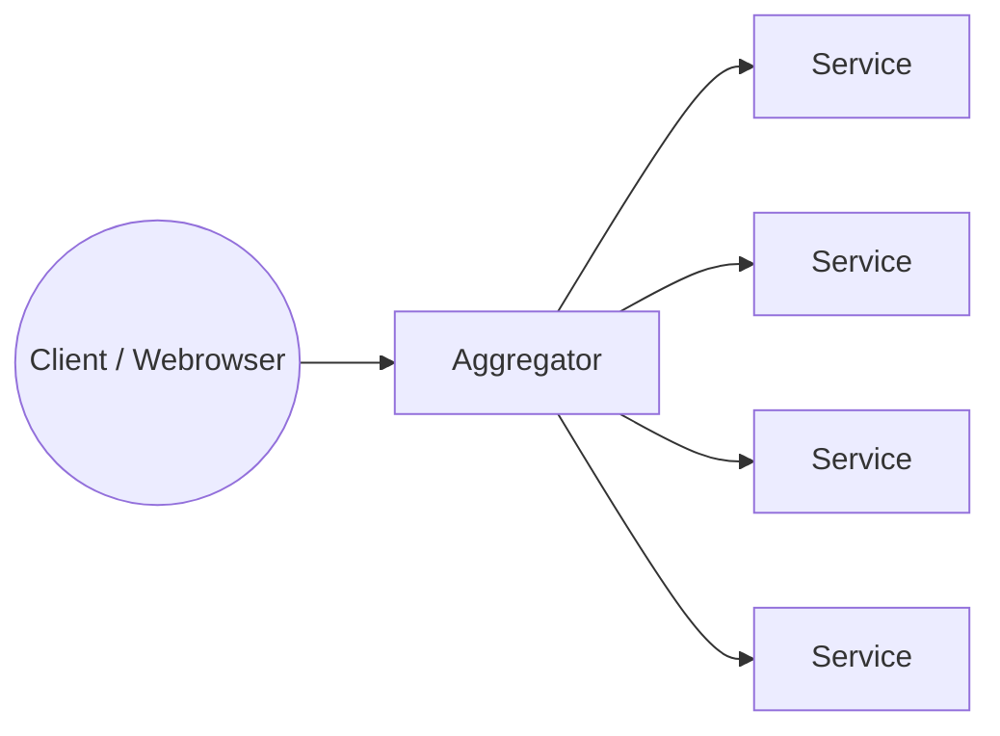

# Gateway Aggregator notes

---

## Problem Statement

- The issues we are trying to solve with this pattern
  - More network calls
  - Browser limits - could ask client to configure but we want to avoid that.
  - Increased Latency
  - Complex aggregation logic on the frontend

## The Aggregator Pattern

- Notice - all the backend logic is hidden and the aggregator service acts like a proxy or a facade
- From the client point of view it is just one call.