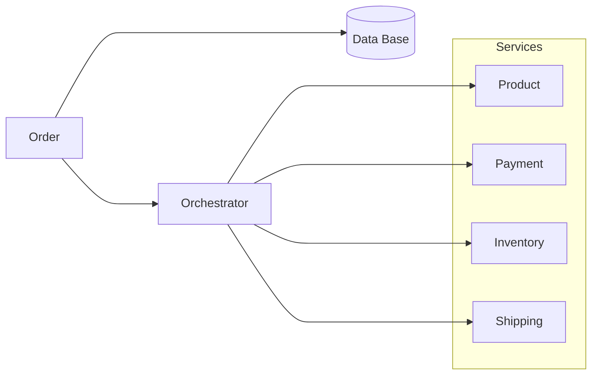
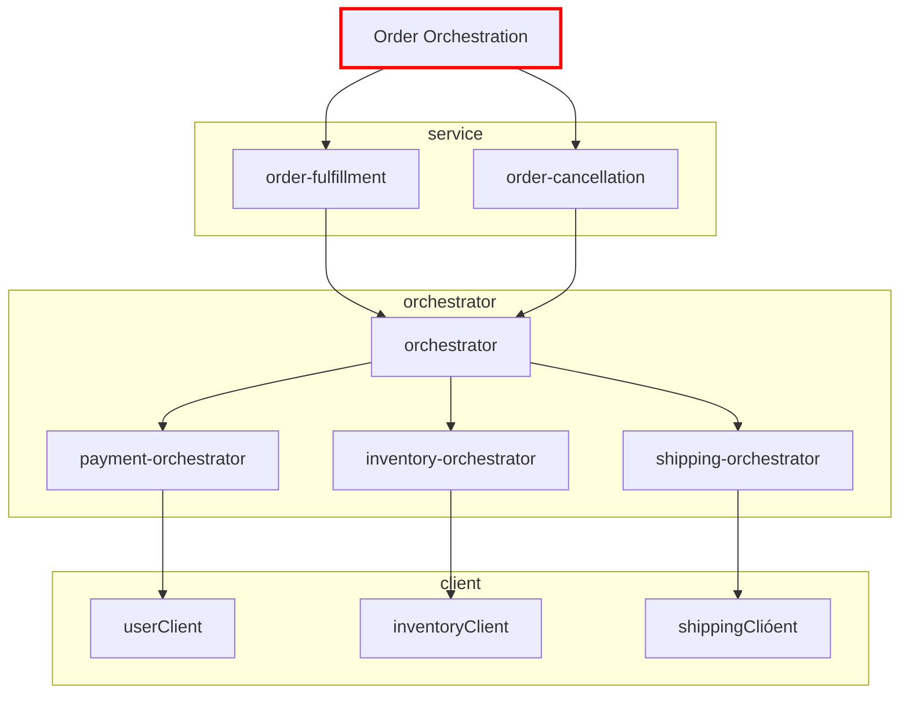

# Orchestrator pattern notes

---

### Overview - Service Orchestrator

- Aggregator - additional business logic to provide a workflow

### Design

| product-service | user-service | inventory-service | shipping-service | Order status | Orchestrator Actions                   |
|-----------------|--------------|-------------------|------------------|--------------|----------------------------------------|
| Success         | Success      | Success           | Success          | Success      |                                        |
| 404             |              |                   |                  |              | 404                                    |
| Success         |              |                   |                  |              |                                        |
| Success         | Failed       | Success           | Success          | Failed       | restore inventory   cancel shipping |
| Success         | Success      | Failed            | Success          | Failed       | refund user   cancel shipping       |
| Success         | Success      | Success           | Failed           | Failed       | refund user   restore inventory     |

---

### Service layer implementation

