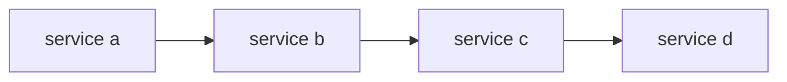
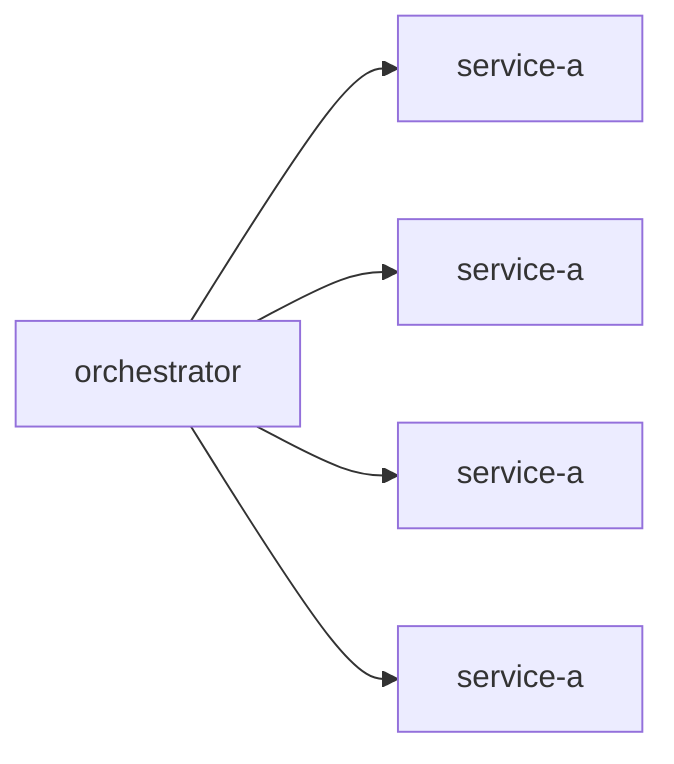

# Sequential Orchestration patter

---

## Chained Pattern

- No special aggregator
- Any service can assume the role of aggregation

## Pros and Cons

- Pros
  - Easy to implement
- Cons
  - Increased Latency
  - Very difficult to debug
  - Very difficult to maintain / implement change in requirements

## Orchestrator for chained workflows

- Orchestrator

