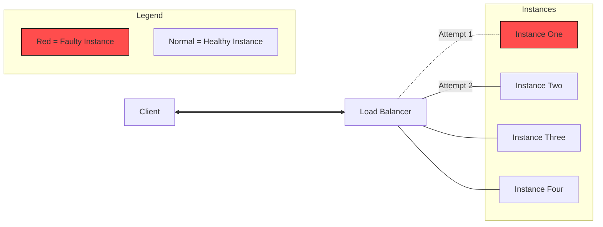

# Retry pattern notes

---

- Transient failure
- In microservices we need to assume that the network is unreliable. I.e anything can happen

---

## Diagram

---

### Summary

- Recover from Transient failure
- It might increase the overall response time
  - Important to set `Timeout`
- Do not retry for 4XX error