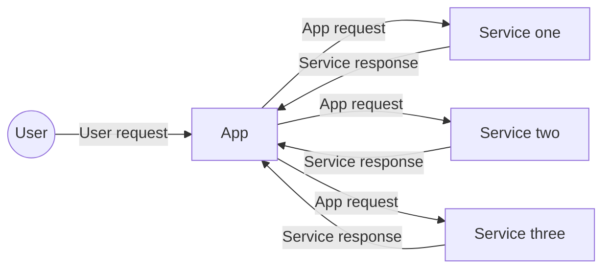

# Scatter gather pattern

---

- Roughly equivalent to the aggregator pattern
- It broadcasts the message to all the recipients and the collects the response

---

## Example Diagram

```mermaid
graph LR

Z((User))
A[App]
B[Service one]
C[Service two]
D[Service three]


Z -->|User request| A
A -->|App request| B
A -->|App request| C
A -->|App request| D
B -->|Service response| A
C -->|Service response| A
D -->|Service response| A

```